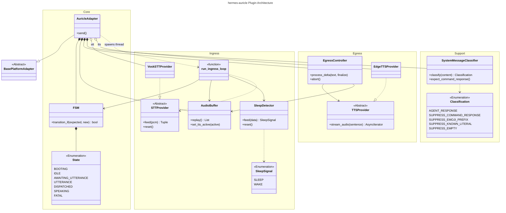

```mermaid
---
title: hermes-auricle Plugin Architecture
config:
class:
    hideEmptyMembersBox: true
---
classDiagram
    direction TB

    class BasePlatformAdapter {
        <<Abstract>>
    }

    namespace Core {
        class AuricleAdapter {
            +send()
        }
        class FSM {
            +transition_if(expected, new) bool
        }
        class State {
            <<Enumeration>>
            BOOTING
            IDLE
            AWAITING_UTTERANCE
            UTTERANCE
            DISPATCHED
            SPEAKING
            FATAL
        }
    }

    namespace Ingress {
        class IngressLoop["run_ingress_loop"] {
            <<function>>
        }
        class AudioBuffer {
            +replay() List
            +set_tts_active(active)
        }
        class SleepDetector {
            +feed(data) SleepSignal
            +reset()
        }
        class SleepSignal {
            <<Enumeration>>
            SLEEP
            WAKE
        }
        class STTProvider {
            <<Abstract>>
            +feed(pcm) Tuple
            +reset()
        }
        class VoskSTTProvider
    }

    namespace Egress {
        class EgressController {
            +process_delta(text, finalize)
            +abort()
        }
        class TTSProvider {
            <<Abstract>>
            +stream_audio(sentence) AsyncIterator
        }
        class EdgeTTSProvider
    }

    namespace Support {
        class SystemMessageClassifier {
            +classify(content) Classification
            +expect_command_response()
        }
        class Classification {
            <<Enumeration>>
            AGENT_RESPONSE
            SUPPRESS_COMMAND_RESPONSE
            SUPPRESS_EMOJI_PREFIX
            SUPPRESS_KNOWN_LITERAL
            SUPPRESS_EMPTY
        }
    }

    %% Inheritance
    AuricleAdapter --|> BasePlatformAdapter

    %% AuricleAdapter composition
    AuricleAdapter *-- FSM
    AuricleAdapter *-- AudioBuffer
    AuricleAdapter *-- EgressController
    AuricleAdapter *-- SystemMessageClassifier
    AuricleAdapter o-- VoskSTTProvider : stt
    AuricleAdapter o-- EdgeTTSProvider : tts

    %% FSM owns its state enum
    FSM *-- State

    %% Adapter spawns ingress thread
    AuricleAdapter ..> IngressLoop : spawns thread

    %% Ingress loop's runtime dependencies
    IngressLoop --> FSM
    IngressLoop --> AudioBuffer
    IngressLoop --> SleepDetector
    IngressLoop ..> STTProvider

    %% SleepDetector emits signals
    SleepDetector ..> SleepSignal

    %% Provider realization
    VoskSTTProvider ..|> STTProvider
    EdgeTTSProvider ..|> TTSProvider

    %% Egress dependencies
    EgressController --> TTSProvider
    EgressController --> AudioBuffer

    %% Classifier emits classification
    SystemMessageClassifier ..> Classification
```