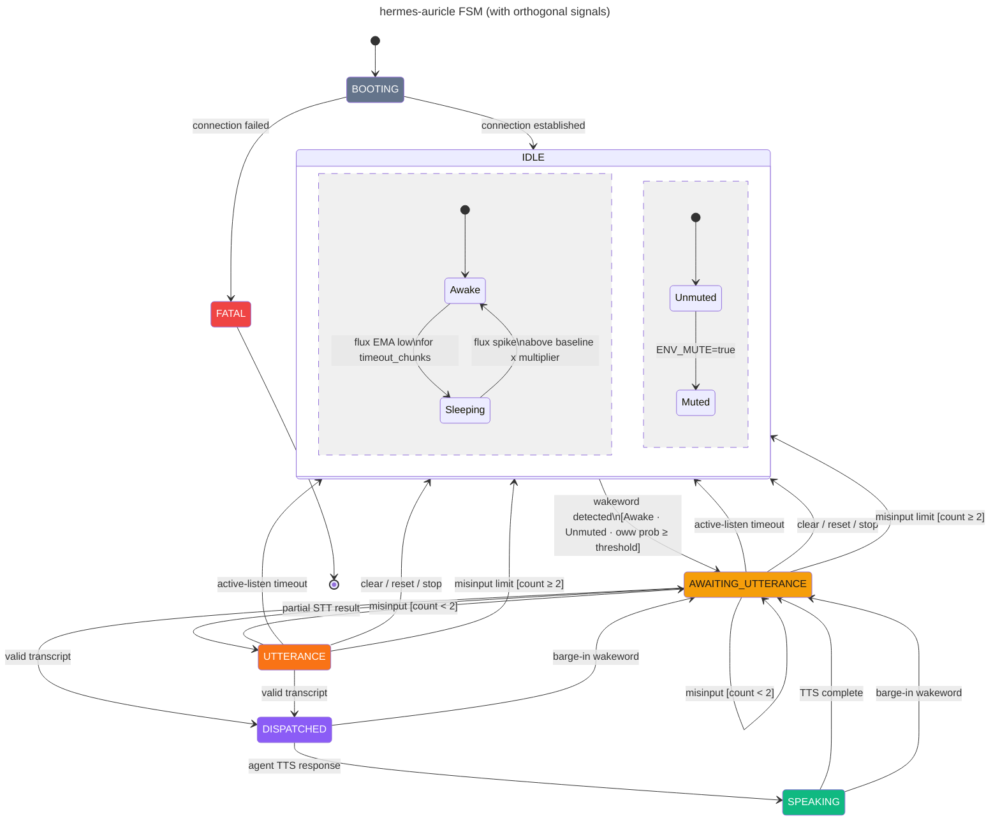

```mermaid
---
title: hermes-auricle FSM (with orthogonal signals)
---
stateDiagram-v2
    direction TB

    classDef boot     fill:#64748b,color:white
    classDef listen   fill:#f59e0b,color:#1c1917
    classDef capture  fill:#f97316,color:white
    classDef dispatch fill:#8b5cf6,color:white
    classDef speak    fill:#10b981,color:white
    classDef err      fill:#ef4444,color:white

    [*] --> BOOTING

    BOOTING --> IDLE  : connection established
    BOOTING --> FATAL : connection failed

    state IDLE {
        %% — orthogonal region 1: sleeping signal (SleepDetector) —
        [*] --> Awake
        Awake    --> Sleeping : flux EMA low\nfor timeout_chunks
        Sleeping --> Awake    : flux spike\nabove baseline x multiplier
        --
        %% — orthogonal region 2: muted flag (ENV_MUTE, static at boot) —
        [*] --> Unmuted
        Unmuted --> Muted : ENV_MUTE=true
    }

    IDLE --> AWAITING_UTTERANCE : wakeword detected\n[Awake · Unmuted · oww prob ≥ threshold]

    AWAITING_UTTERANCE --> UTTERANCE          : partial STT result
    AWAITING_UTTERANCE --> AWAITING_UTTERANCE : misinput [count < 2]
    AWAITING_UTTERANCE --> IDLE               : active-listen timeout
    AWAITING_UTTERANCE --> IDLE               : clear / reset / stop
    AWAITING_UTTERANCE --> IDLE               : misinput limit [count ≥ 2]
    AWAITING_UTTERANCE --> DISPATCHED         : valid transcript

    UTTERANCE --> AWAITING_UTTERANCE : misinput [count < 2]
    UTTERANCE --> IDLE               : active-listen timeout
    UTTERANCE --> IDLE               : clear / reset / stop
    UTTERANCE --> IDLE               : misinput limit [count ≥ 2]
    UTTERANCE --> DISPATCHED         : valid transcript

    DISPATCHED --> SPEAKING           : agent TTS response
    DISPATCHED --> AWAITING_UTTERANCE : barge-in wakeword

    SPEAKING --> AWAITING_UTTERANCE : TTS complete
    SPEAKING --> AWAITING_UTTERANCE : barge-in wakeword

    FATAL --> [*]

    class BOOTING boot
    class AWAITING_UTTERANCE listen
    class UTTERANCE capture
    class DISPATCHED dispatch
    class SPEAKING speak
    class FATAL err
```